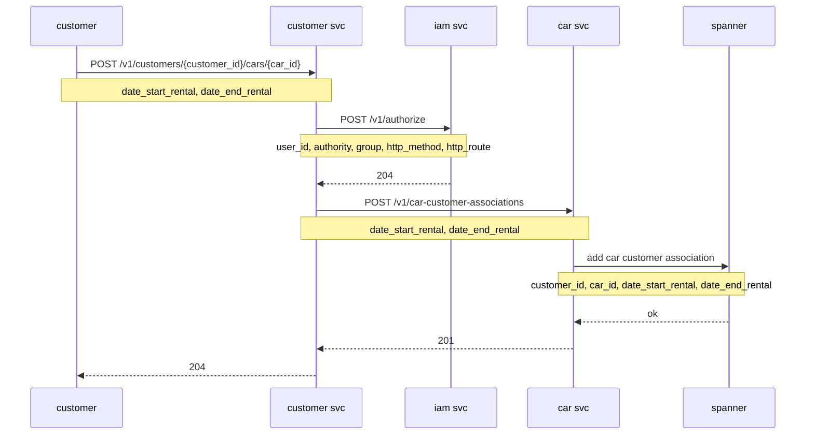
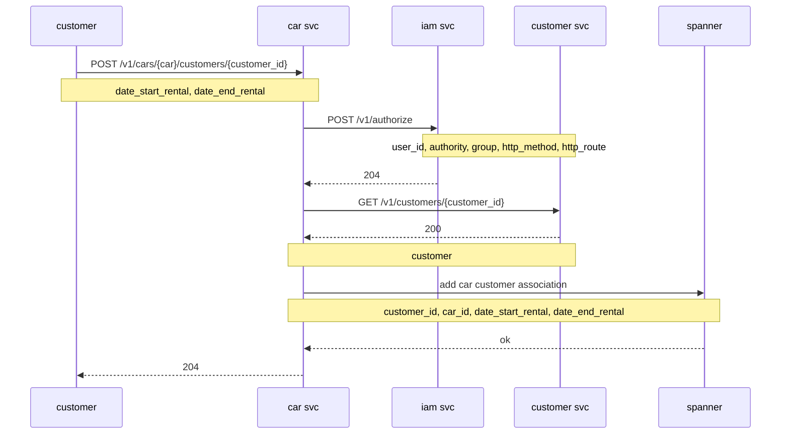

# User rents a car

## happy path

## option 1: from customer svc

```mermaid
sequenceDiagram
  customer->>customer svc:POST /v1/customers/{customer_id}/cars/{car_id}
  Note over customer, customer svc: date_start_rental, date_end_rental
  customer svc->>iam svc:POST /v1/authorize
  Note over customer svc, iam svc: user_id, authority, group, http_method, http_route
  iam svc-->>customer svc: 204
  customer svc->>car svc:POST /v1/car-customer-associations
  Note over customer svc, car svc: date_start_rental, date_end_rental
  car svc->>spanner: add car customer association
  Note over car svc, spanner: customer_id, car_id, date_start_rental, date_end_rental
  spanner-->>car svc: ok
  car svc-->>customer svc: 201
  customer svc-->>customer: 204
```

## option 2: from car svc

```mermaid
sequenceDiagram
  customer->>car svc:POST /v1/cars/{car}/customers/{customer_id}
  Note over customer, car svc: date_start_rental, date_end_rental
  car svc->>iam svc:POST /v1/authorize
  Note over customer svc, iam svc: user_id, authority, group, http_method, http_route
  iam svc-->>car svc: 204
  car svc->>customer svc: GET /v1/customers/{customer_id}
  customer svc-->>car svc: 200
  Note over customer svc, car svc: customer
  car svc->>spanner: add car customer association
  Note over car svc, spanner: customer_id, car_id, date_start_rental, date_end_rental
  spanner-->>car svc: ok
  car svc-->>customer: 204
```